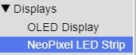
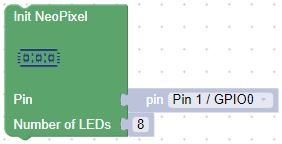

# Welcome to the BIPES Moving Rainbow Website!

## About the BIPES Moving Rainbow Project

Moving Rainbow is a way to learn the basics of programming using LED strips.  We use low-cost components so you can build entire projects and costumes with 100s of LEDs for under $20.  Since 2014 we have been building low-cost kits that teach all the concepts of [Computational Thinking](https://www.coderdojotc.org/CoderDojoTC/computational-thinking/)](https://www.coderdojotc.org/CoderDojoTC/computational-thinking/).

## Raspberry Pi Pico

The Raspberry Pi Pico cost only $4 and runs Python.  All our labs use this processor.

## Breadboards

In our projects we use 1/2 sized breadboard with 400 tie points.

## Programming the LED strip with BIPES

We'll use [BIPES](https://bipes.net.br/pico/ui/) to control the Raspberry Pi Pico and an 8 pixel LED strip.  The strip is initialized by selecting the Init NeoPixel Block from the Displays navigation/NeoPixel LED Strip sub menu.  We'll initialize the block to use GPIO0 as our data pin and we have 8 LEDs in our strip

 

!!! Note
All the blocks in these lessons can be downloaded from the git repo where this site is hosted.  Once the xml files are downloaded, you can upload them in BIPES!