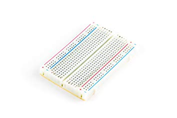

# Welcome to the BIPES Moving Rainbow Website!

## About the BIPES Moving Rainbow Project

Moving Rainbow is a way to learn the basics of programming using LED strips.  We use low-cost components so you can build entire projects and costumes with 100s of LEDs for under $20.  Since 2014 we have been building low-cost kits that teach all the concepts of [Computational Thinking](https://www.coderdojotc.org/CoderDojoTC/computational-thinking/)](https://www.coderdojotc.org/CoderDojoTC/computational-thinking/).

## Raspberry Pi Pico

The Raspberry Pi Pico cost only $4 and runs Python.  All our labs use this processor.

## Breadboards

In our projects we use 1/2 sized breadboard with 400 tie points.

## Mode Buttons
A "mode" is a way of having a single Arduino program run multiple patterns on the LED strip.  Each mode has a number associated with it
starting with 0 and continuing to the number of patterns we have in our program.

In this section we will add two mode buttons.  One button will make the pattern mode go to the next mode.  The other button will go to the previous mode.

## Programming the LED strip with BIPES

We'll use BIPES to control the Raspberry Pi Pico and an 8 pixel LED strip.  The strip is initialized by selecting the Init NeoPixel Block from the Displays navigation/NeoPixel LED Strip sub menu.  We'll initialize the block to use GPIO0 as our data pin and we have 8 LEDs in our strip

 