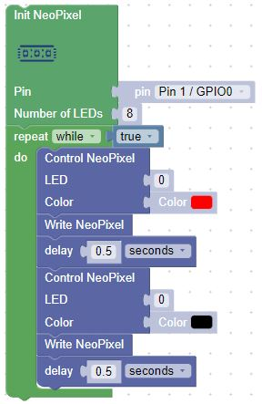
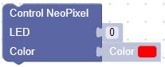
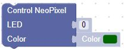
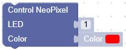
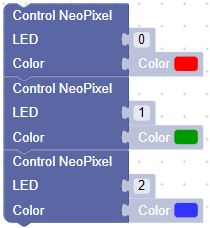
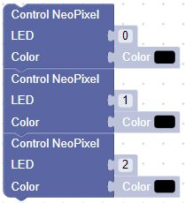

# Blink

Here is one of simplest moving rainbow programs.  It is our version of "Hello World!. 

Our first program will just blink the first pixel on and off every 1/2 second.

## Exercises

### Change the Color Lab
1. Change the block: 

to be:

What happens?

### Change the Position Lab

1. Change the block: 

to be:

What happens?

### Change the Sleep Time

What happens if you change the sleep time?

to be:

What is the smallest time you can use and still see flashing?  Hint: Try values like .05, or .005

### RGB Lab

1. Change the single red block to

and change the single black block to

What happened?

### Why Do We Need block Write NeoPixel?

Try to remove one of the block that does Write NeoPixel.  What happens?  Why do you think we need this block?

### LED Strip State

What happens if you stop the program when the LED strip LEDs are on? 

### On Your Own

What if you extended the lab to more positions and colors?