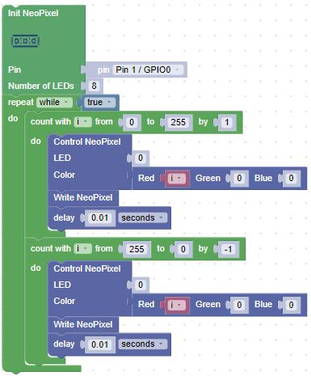

# Fade In and Out Lab

What if instead of the first LED just turning on and off we want to slowly make the LED get brighter and then slowly dimmer?  To do this we will change the brightness of the red from off (0) to fully on (255) in steps
with a small delay of 1/100th of a second between the steps.

]