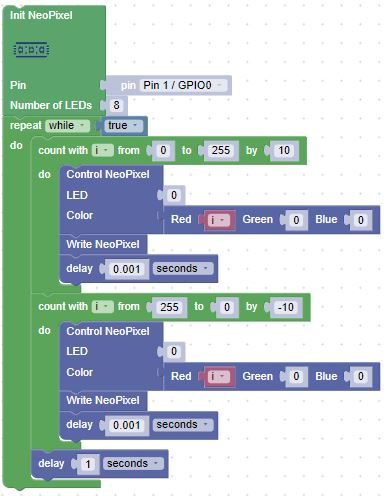

# Heartbeat Lab

What if you were building a robot and you wanted to flash the LED to look like a human heartbeat? 
Instead of slowing fading in and out, you would want the brightness to follow the electrical signals coming from the heart. This is called an elecrto cardiogram (EKG) and it look like this:

Notice that the signal is low for about one second and then it spikes up to maximum brightness and then comes back down. When we are moving the brightness up and down, we don't have to pause between each of the 256 brightness values. The eye can't usually see the intermediate brightness values if the brightness is changing quickly. To make our code efficient we can skip over 9 out of 10 of the brightness gradations between 0 and 255.

The following blocks emulates this heart beat pattern:

