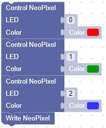
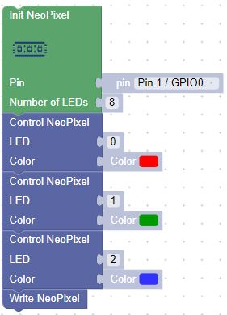
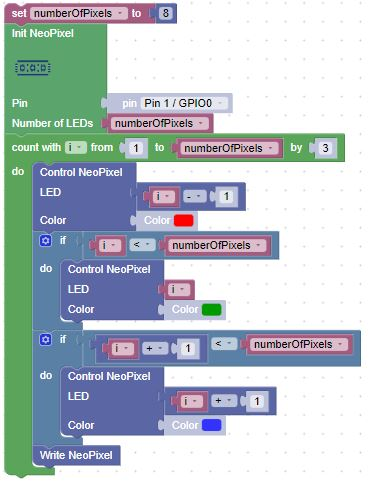

# Red, Green and Blue

In this lesson, we will draw three different colors at three different locations on the LED strip.  We will then repeat this pattern down the strip.

Our first task is to draw the red, green and blue in the first three pixels of the LED strip.

Our blocks will be the following

## Full Set of Blocks (adding the NeoPixel Init)

## Repeating the Pattern

Now, let's repeat this pattern over the entire strip.  We can do this by wrapping the three lines in a  loop like this:

Note here that the loop block has a third parameter that tells us how many to skip in each iteration of the loop.  Since we have three colors, we can skip every three values of i.  I will get values of 1, 4, 7.  Our Pixel Strip starts at 0 as the first LED, so we have to subtract 1 from i to get the first LED to light.  I also have to check to make sure I don't try to turn on an LED past the end of the strip.
