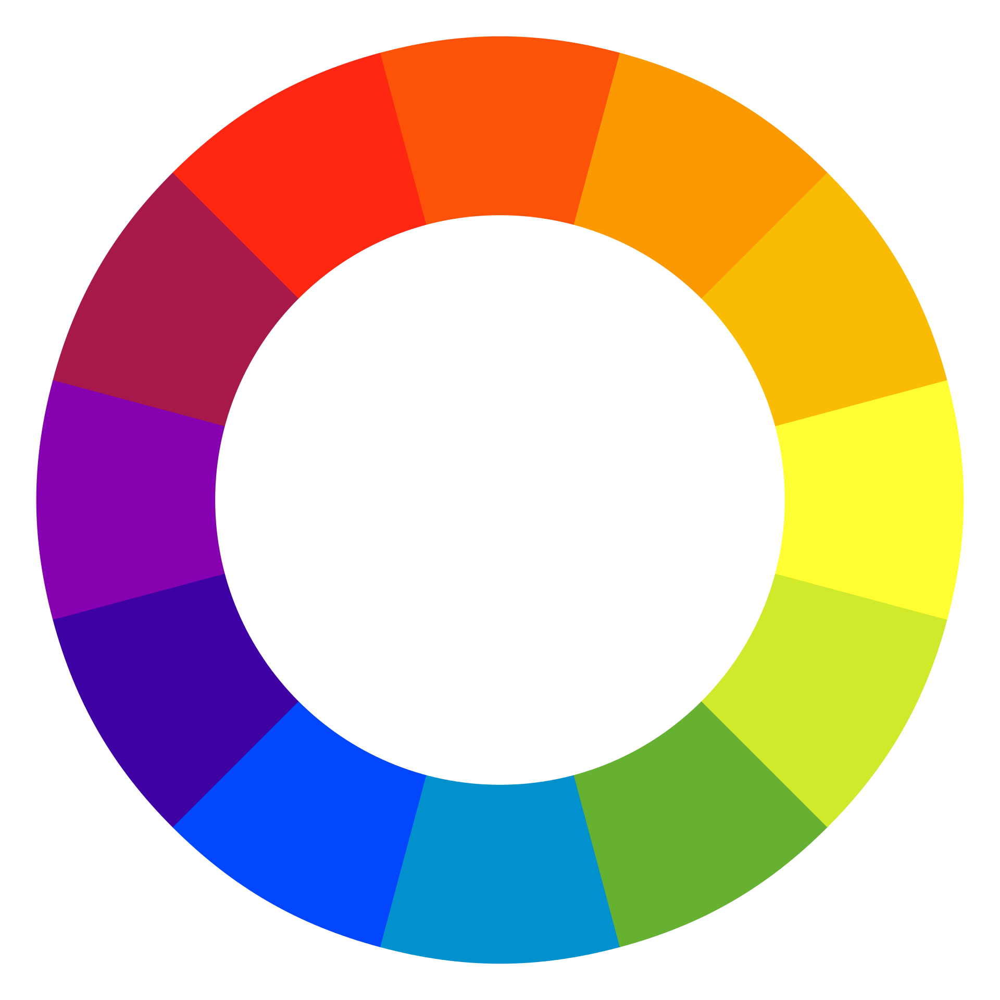
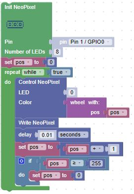

# Color Wheel Lab

What if we wanted to slowly vary the color of one of our pixels through all the colors of the rainbow?  What we would like is a function that would take in an number from 0 to 255 and walk around the color wheel as you change the input value.  This is known as the wheel function:

If you follow the logic, you will see that the colors range from red through green and to blue and back to red:

wheel(1) = (255, 0, 0) # red

wheel(85) = (0,255, 0) # green

wheel(170) = (0, 0, 255) # blue

wheel(255) = (255, 0, 0) # red

## Full Program

This set of blocks will call the wheel function in the set of blocks above continuously

