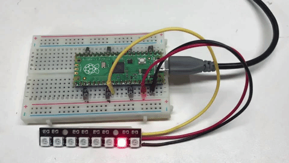

# Motion



Turning individual pixels on and off is pretty easy.  But the results can be pretty boring after a while.  But don't worry, we can now create a program that is a lot more fun!

This program uses the loop block.  It uses a counter to turn on successive pixels in the strip.  For each pixel it turn it on, delays for a short period of time, and then turns it off.  It then moves on to the next pixel until each pixel is the strip has been turned on for short period.

## Move a Red Pixel

The following set of blocks illustrates this process.


You will note that this program is similar to the blink lab with a few key differences:

1. The code that turns the pixel on and off is inside the for loop.
2. There is no delay or write after we turn it off.  You could add these back in, but they are not really needed.

Note that the delary time in this program is stored in the ```delay``` variable and it is a pretty short delay.  The shorter the delay, the faster the pixel will appear to move.

## Experiments

### Change the Delay

Try to change the ```delay``` variable to different values.  Note how slow the pixel moves if you make the delay a full second.  This is pretty boring.

1. Change the delay to be .01.  This is 1/100th of a second.
2. What is the fastest you can make the pixel move?
3. What happens if you make the delay less than ```.001```.  Can you still notice the change in the speed?  Many people can't tell the difference because the time to execute the Write NeoPixel block is much longer than the delay.

### Down and Back

Next, lets try to make the pixel appear to move down the LED strip and then back up.  We call this the "Down and Back" pattern.  To do this we just need to duplicate the for loop, but change the range of the index.  Instead of going from 0 to NUMBER_PIXELS - 1, we will start at NUMBER_PIXELS - 1 and then go backwards each step:


1. Try to change the color of the pixel.
2. Try to change the direction of motion from the last to the beginning pixel.
 