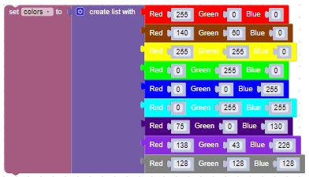
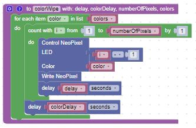
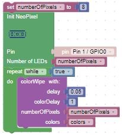

# Color Wipe

This lesson shows you how to change the color of the entire LED strip pixel by pixel.  There will be two delays that we can control:

1. the delay between each pixel update - this is usually about 1/20th of a second
2. the delay between colors - this is usually about 1 to 2 seconds

## A Simple Color Wipe Function

To write this program, we will create a simple Python function that will cycle through all the colors in a list.  Our color list will look like this:

Our Color Wipe set of blocks will take the list of colors and set each LED to one color at a time, delaying delay seconds between setting each LED and colorDelay seconds before transitioning to the next color in our list.

Finally, the main set of blocks calls the colorWipe set of blocks in an endless loop.

