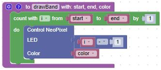
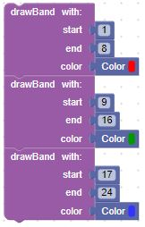
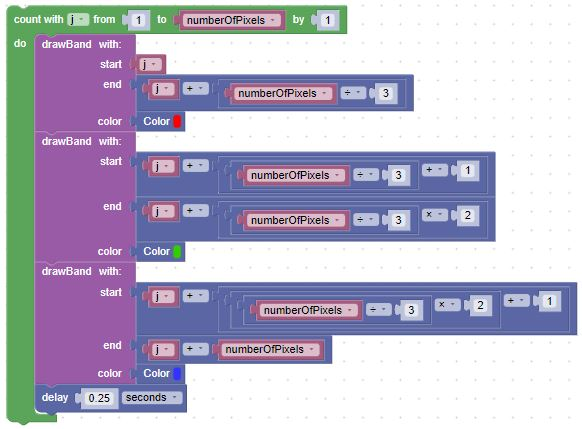
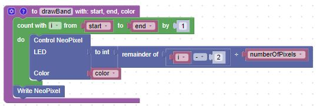

# Moving Bands of Color

In this lesson, we will create a program that will move a set of bands of color down the LED strip.  To do this we will create a function called ```drawBand(start, end, color)``` that will fill a range of pixels with a given color.



We can then draw three "bands" of color like this:



We can make this group of bands appear to move by adding a offset to the start like this:



This will work fine until the value of i plus the offset exceeds the length of the LED strip.  To get around this, we should never write to location i by itself.  We should always divide i by the strip lenght and write to the remainder, what is call modulo and it is implemented as the remainder block.  We just have to change one line in the drawBand function:

