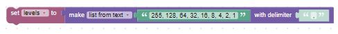
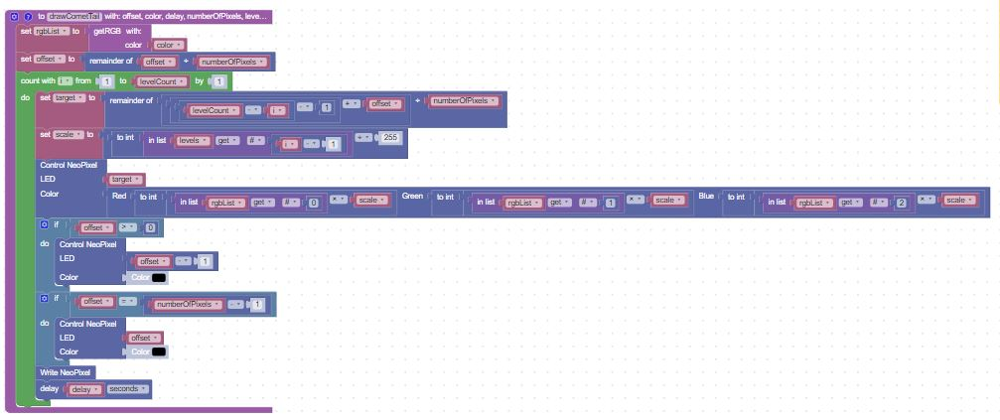
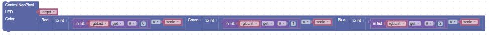
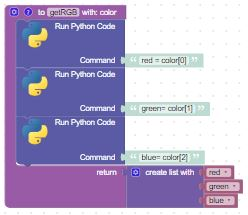
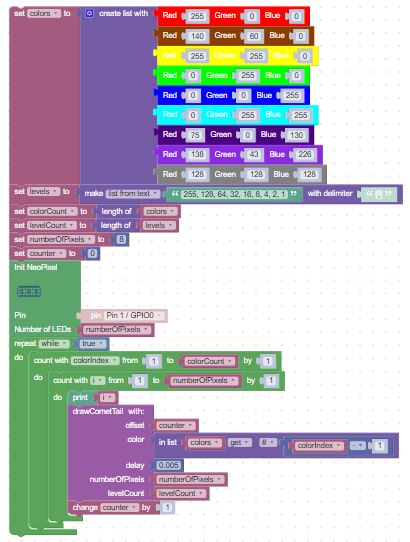

# Comet Tail

In this lesson we will make a pattern of light like a comet tail.  The comet will consist of about 5 to 10 pixels in a row and move across the strip by shifting the offset by a single pixel and then redrawing the comet.

## Setting The Brightness

Our first task is to draw a single comet tail that will make the head of the comet bright (225) and slowly decrease the brightness behind the head of the comet.  In general, each pixel will be half as bright and the prior pixel.

The "levels" of brightness can be stored in a list.  Our list will look like this:

## The Draw Comet Tail Function
Our function will have five parameters:

1. The offset from pixel 0
2. The color to draw the pixel as a tuple of three integers
3. The delay between the draws which will control the speed that the comet appears to move down the strip
4. Number of LEDs in the strip
5. Number of brighness levels in our list

Here is an example of this function:

The most complex line is this one:

This line sets the RGB values of the target.  It must take the color values that are passed in as parameters and scale them for the current brightness of the tail of the comet.  After it does the multiplication, it must use the int block to round the value to the nearest integer.

## Breaking Apart a Color into RGB (Red, Green, Blue) Values

Since BIPES does not have the ability to break apart the color parameter into seperate RGB values, we have to rely on the Run Python Code block to do the work for us.  The Run Python Code block allows us to run Python commands as if they were a block.  In this case, we embed the block inside a function call and let it do the work for us, returning a list that we can use above.

## Main Blocks

The main set of blocks sets up our color and brightness lists, initializes our NeoPixel strip, then calls the function to draw the comet

