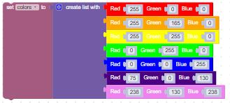
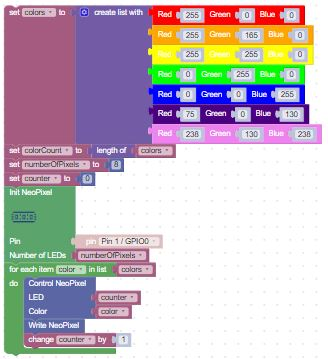
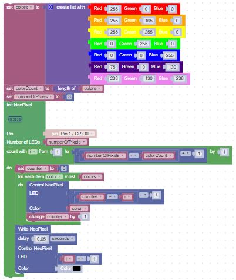
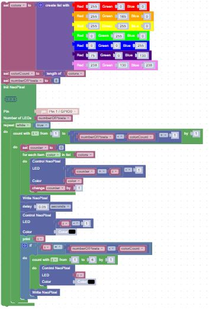

# Moving Rainbow

In this lesson we will combine the work we did with the color wheel with the motion lesson to create a new lab that moves a block of different colors over the LED strip.  This lab is a little tricker because we need to pay careful attention to our work at the beginning and end of the LED strip to avoid setting values outside the valid indexes of our strip.

We will begin with drawing a static hand-built list of colors on our strip.  We call this doing it "the hard way".  After that we will show you have to create more a more flexible version using the color wheel function that we covered in a previous lab.

## The Classic Rainbow

Let's begin by simply creating a named list of colors in a rainbow: red, orange, yellow, green, blue, indigo and violet.  We can lookup the red, green and blue values of these colors on [Wikipedia](https://en.wikipedia.org/wiki/Web_colors#Basic_colors).

|Color|Red, Green, and Blue|
|-----|-------------------|
|Red|255,0,0|
|Orange|255,165,0|
|Yellow|255,255,0|
|Green|0,255,0|
|Blue|0,0,255|
|Indigo|75,0,130|
|Violet|238,130,238|

We can then put the colors into a list:



## Draw the Rainbow

We can then draw these colors in each of the first seven pixels like this:



## Move the Rainbow

We can then "move" this pattern down the strip until we reach the end by redrawing it over and over and erasing it in between.



There are a few tricky adjustments we had to make:

1. We added the index counter to the strip index so that we would start drawing at a different point each time.
2. We had to not go to the end of the LED strip.  We had to stop ```num_colors + 1``` before the end of the strip.
3. We had to erase the current pixel after we drew the colors

## Repeating the Moving Rainbow

Finally, we can wrap this entire section in a repeat while true block that will keep running the pattern over and over.



Note that we had to add a few extra blocks to make the final draw get removed after the last draw in the outer loop.

## Improving on the Moving Rainbow

This program is simple to read, but there are several ways we could improve it.

One of the awkward characteristics of the program is that he rainbow pattern just suddenly "appears" at the front of the strip and then "disappears" at the end of the strip.  This is OK for a strip in a line, but if you wrap the strip in a circle it looks odd.

For a circular loop we would like the pattern to appear one pixel at a time and then appear to slide from the end to the beginning of the strip.  We can achieve this by using the modulo function.  It will take a counter and find the "remainder" after we divide it by the number of pixels in the strip.

What if we wanted our rainbow to be a different number of pixels?  It would be ideal of we could just write a function that would draw the right pixels at the right place.  Perhaps we could just add a parameter to that function for the number of pixels in our rainbow?

