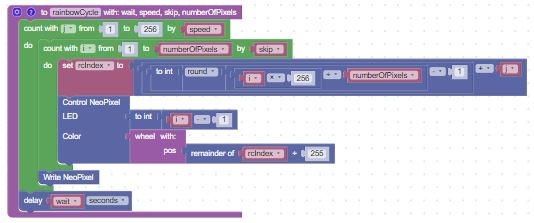
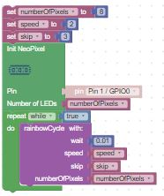

# Rainbow Cycle

In this lesson we will use the wheel function to slowly cycle each pixel in a range through each of the colors of the rainbow.

## The Rainbow Cycle Function
We create a function called rainbow_cycle() that has four parameters.  The first is a delay, the second is a number that increase the precision of the color changes which impacts the speed, the third is how many pixels to skip over, and the forth is the number of LEDs in the strip.

Next, we place a repeat while true loop block and call the function repeatedly.  

## Power Considerations

This program has the ability to drive every single pixel on the strip.  This has the disadvantage that it will drain batteries too quickly or exceed the power levels of a USB power supply.

To get around this you can up the skip parameter to only turn on every 2nd, 3rd or 4th pixel.

The entire rainbow cycle loop takes a few seconds to run, so be aware of this limitation if you are adding controls or interrupts.

## Wheel Function

The rainbox function makes a call to the wheel function that was created in a previous lesson.

## Main Blocks

Here are the main blocks that call the functions.  Make sure to change the NUMBER_PIXELS parameter to match the length of your LED strip.

