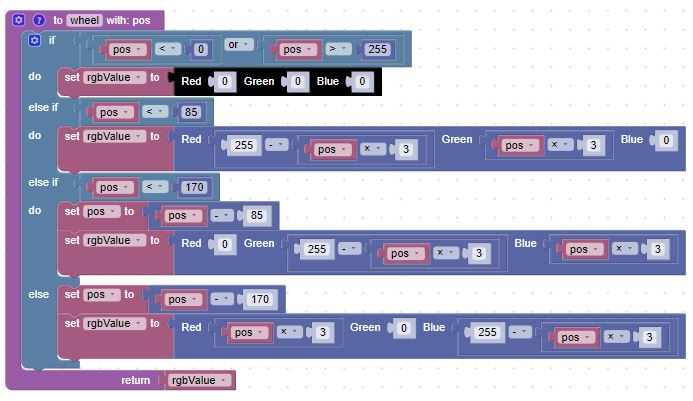
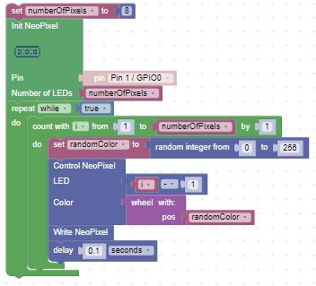

# Random Drawing

In this lesson we will introduce the ability to draw random colors at random pixels.  This allows us to create more natural patterns such as the flicking light of a candle.

## The Random Block

We need a block that will generate a random integer between a range of values. This is called the random integer block in the Math navigation menu and it takes two parameters.  In our case, we can just pass in the minimum and maximum values:

You can read more about MicroPython random functions [here](https://docs.micropython.org/en/latest/library/random.html)

We will be using the wheel() function that we used earlier:

## Wheel Function

## Main Blocks

## Exercises

1. Instead of updating a single pixel in consecutive sequences, can you also use the
random integer block to update a random pixel?
2. What if you have a small fixed list of colors to pick from.  How can you use random integer block to pick a color from this list?