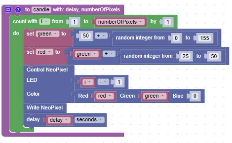
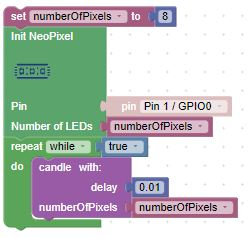

# Candle Flicker

In this lesson we will try to simulate the behavior of a flickering candle using
the ```randint()``` function.  To do this we will need a function that generates a mostly yellow-orange color, but the actual color and and brightness will vary.  This will give the impression of a candle flame with a flicker.

A pure yellow color has both the red and green values on and the blue value off:

```python
yellow = (255, 255, 0)
orange = (255, 150, 0)
```

Our goal is to generate variations in both color and brightness.  We can do this by starteding out with a green that varies from 50 to 200 and a red that varies above this value by 25 to 50.

## Sample Candle Function

Our function will draw the new value on a random location on the LED strip.  It will take a single parameter of the delay on how often the values are updated, typically about 1/100th of a second.



## Main Demonstration Blocks


