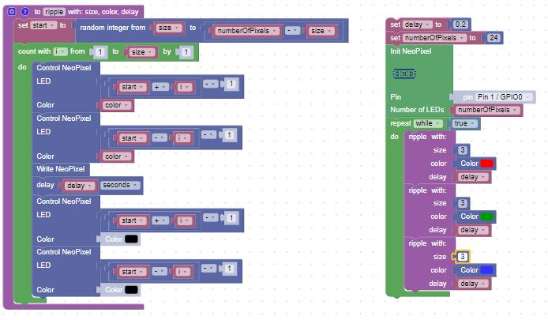

# Ripple Patterns

## Exercises

1. Make the color random
2. Make the size of the ripple random
3. Add randomness to the delay
4. Use the wheel function to pick a random color
5. Make the pixel intensity get lower as the ripple expands