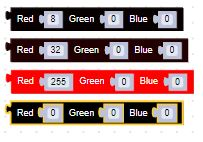
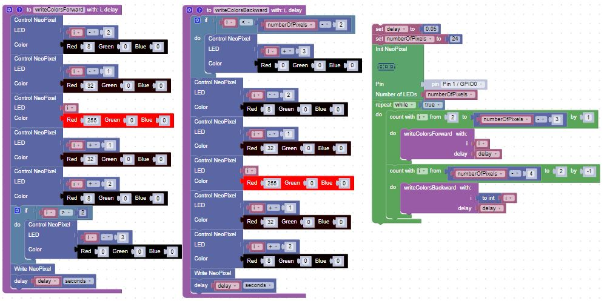

# Larson Scanner

The Larson Scanner is a light pattern special effect named after [Glen A. Larson](https://en.wikipedia.org/wiki/Glen_A._Larson).  Larson used this pattern to give his [Battlestar Galactica Cylon](https://en.wikipedia.org/wiki/Cylon_(Battlestar_Galactica)) and [KITT](https://en.wikipedia.org/wiki/KITT) robot eyes a sense of sentience.  See [Knight Rider](https://en.wikipedia.org/wiki/Knight_Rider_(1982_TV_series)) for the backstory.

## Description

A set of usually red pixels moves back and forth over the LED strip.  The pixels are brighter in the center and are dimmer at the edges of the set.  You can see an example of this in the [Larson Scanner Pumpkin Kit](https://www.coderdojotc.org/micropython/kits/larson-scanner/01-intro/)

## Color RGB values

We will need a set of predefined colors for various brightness of red:

Note that the color levels are not linear.  You can adjust these and add more intermediate levels for wider patterns.

## Full Set of Blocks

## Exercises

1. Add a color parameter
2. Add a parameter for the width of the pattern